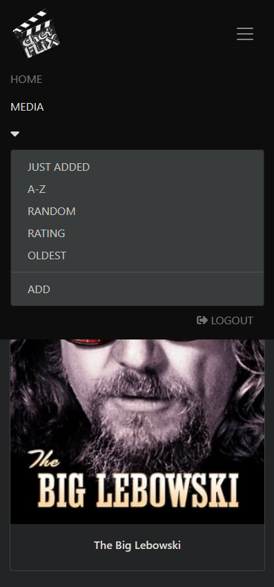

# chetflix
<a href="https://www.chetflix.ddns.net">Click here for demo</a>

This fun project is a Computer Hobbies Entertainment Technologist "CHET" video webserver for your archived DVD library
in a django, python, postgreSQL, and NGINX environment.  chetflix allows for ordering of large libraries with 
automated adding of movie plots, ratings, and posters from a simple title submission. 

### Various sorting options & search of library with automatic posters

### Pagination for large libraries

### Automatic plot, rating, year, titles in viewing page
   & edit icon only shows for superusers 

### Role based additions need only title & file for pulling information

### Responsive phone web browser view (from local server IP)

### Phone menu & dropdown

   
